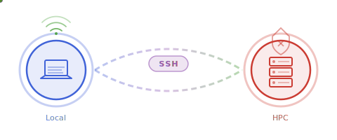

<p align="center">
  
</p>

<h1 align="center">OfflineHPC.jl</h1>

<p align="center">
  <em>Install Julia packages on air-gapped HPC systems through an SSH reverse tunnel proxy.</em>
  <br/>
  Zero external dependencies — uses only Julia stdlib.
</p>

<p align="center">
  <a href="https://github.com/XingyuZhang2018/OfflineHPC.jl/actions/workflows/CI.yml"></a>
  <a href="https://codecov.io/gh/XingyuZhang2018/OfflineHPC.jl"></a>
</p>

## Quick Start

### Local machine (has internet)

```julia
using OfflineHPC
state = serve("user@hpc.example.com", port=8080)
```

### HPC (no internet)

```julia
include("connect.jl")
OfflineHPCClient.connect(port=8080)

# Now use Pkg normally:
using Pkg
Pkg.add("Example")
```

## Setup

1. Install OfflineHPC.jl on your local machine:
   ```julia
   using Pkg; Pkg.develop(path="path/to/offline_hpc")
   ```

2. Copy `scripts/connect.jl` to your HPC:
   ```bash
   scp scripts/connect.jl user@hpc:~/connect.jl
   ```

## Manual tunnel mode

If you prefer to manage the SSH tunnel yourself:

```julia
# Local: start only the proxy
state = serve(port=8080)
```

Then in another terminal:
```bash
ssh -R 8080:localhost:8080 -N user@hpc
```

## Verbose logging

```julia
OfflineHPC.set_verbose(true)
```
